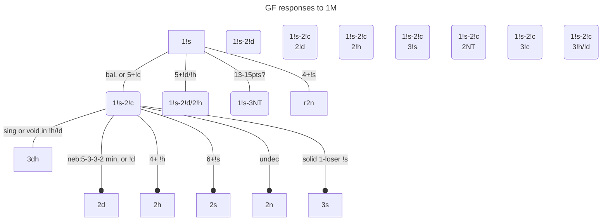
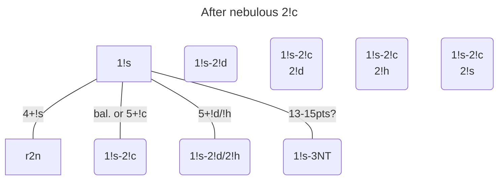

```mermaid
---
title: GF responses to 1M
---
flowchart TD

o1s["1!s"]

r2c("1!s-2!c")
r2d("1!s-2!d")
r2dh("1!s-2!d/2!h")
r3n("1!s-3NT")

o2d("1!s-2!c
    2!d")
o2h("1!s-2!c
    2!h")
o2s("1!s-2!c
    2!s")
o2s("1!s-2!c
    3!s")
o2n("1!s-2!c
    2NT")
o3c("1!s-2!c
    3!c")
o3dh("1!s-2!c
    "3!h/!d)

o1s--"4+!s"---r2n
o1s--"bal. or 5+!c"---r2c
o1s--"5+!d/!h"---r2dh
o1s--"13-15pts?"---r3n

r2c--"neb:5-3-3-2 min, or !d"---o2d
r2c--"4+ !h"---o2h
r2c--"6+!s"---o2s
r2c--"undec"---o2n
r2c--"solid 1-loser !s"---o3s
r2c--"sing or void in !h/!d"---3dh

```

```mermaid
---
title: After nebulous 2!c
---
flowchart TD

o1s["1!s"]

r2c("1!s-2!c")
r2d("1!s-2!d")
r2dh("1!s-2!d/2!h")
r3n("1!s-3NT")

o2d("1!s-2!c
    "2!d)
o2h("1!s-2!c
    "2!h)
o2s("1!s-2!c
    "2!s)

o1s--"4+!s"---r2n
o1s--"bal. or 5+!c"---r2c
o1s--"5+!d/!h"---r2dh
o1s--"13-15pts?"---r3n

```
